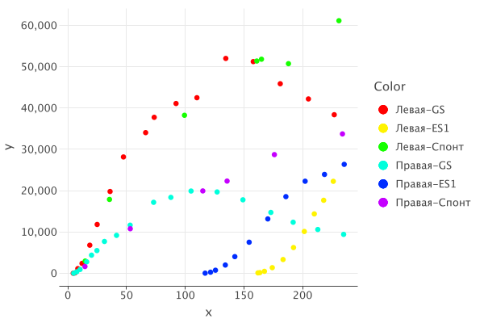

# Spikes Detection

This is a simple program that can [detect spikes on a noisy graph](#Visualize-Spikes-Detection),
and then [automatically integrate them](#Integration). Additionally, it can also [dump noise visualizations](#Visualize-Noise).

## How to Use

The only supported input data file format is `asc`.

Output path is expected to point to a folder: this folder is then populated by the resulting files.

### Visualize Spikes Detection


```zsh
java -jar SpikesDetection.jar \
  --mode spikes-detection \
  --in path/folder1/subfolder1 \
  --in path/folder1/subfolder2 \
  --path-prefix path \
  --out output/folder
```

All files from every `--in` will be processed into new `png` files and stored in the output folder.
If their names would clash, they become `file.asc.png`, `file.asc.2.png`, `file.asc.3.png`, ...
If an optional `--path-prefix` is specified, file names get prepended with a portion of their absolute path between
the value of this option and their names with `-` in place of the path separator.
In the example above they would be `folder1-subfolder1-file.asc.png`, ...

Spikes detection is done by splitting the graph into some "optimal" number of segments,
each is then analyzed according to the selected `--fitting` and `--deviation` [methods](#Additional-Parameters).
The number of segments is iteratively increased until the noise deviation estimate starts improving slower than by 10%
per step.

Also see [Additional Parameters](#Additional-Parameters) to learn more about other options.

### Visualize Noise


```zsh
java -jar SpikesDetection.jar \
  --mode noise-visualization \
  --in path/folder1/subfolder1 \
  --in path/folder1/subfolder2 \
  --path-prefix path \
  --out output/folder
```

The options mentioned above work the same way as they do in [Visualize Spikes Detection](#Visualize-Spikes-Detection).

During noise deviation, the graph is not splitted into segments, to avoid generating multiple noise graphs.
It's assumed this nuance is not crucial in determining the optimal value of the `--bell` parameter.

Also see [Additional Parameters](#Additional-Parameters) to learn more about other options.

### Integration



```zsh
java -jar SpikesDetection.jar \
  --mode integration \
  --in path/folder1/subfolder1 \
  --in path/folder1/subfolder2 \
  --path-prefix path \
  --out output/folder
```

In this mode every `--in` must denote a folder containing files like `161.asc`, `14,8.asc`, ...
That is, named as a comma-separated real number.
This mode results in 2 files generated in the output folder:
`integration.png` and `integration-data.csv`. The former is a plot where the
horizontal axis represents values denoted by the file names, and the vertical axis
is the result of numeric integration of the spikes within the corresponding file.

Integration is done by summing trapezoids' areas formed by adjacent values.
During integration, the expected function value is subtracted from the spikes.
During integration mode, the graph is split into segments the same way [it is for Spikes Detection](#Spikes-Detection).

Note that if there are multiple `--in`s with the same final `/subfilder` and there's no `--path-prefix` to help
avoiding clashes, then `integration.png` will miss all but 1 clashing datasets.

### Additional Parameters

| Option               | Description                                                                                                                                                                                                                                                                                                                                                                                                                                                                                                                                                                                                               |
|----------------------|---------------------------------------------------------------------------------------------------------------------------------------------------------------------------------------------------------------------------------------------------------------------------------------------------------------------------------------------------------------------------------------------------------------------------------------------------------------------------------------------------------------------------------------------------------------------------------------------------------------------------|
| `--bell`             | This parameter controls σ of the normal distribution bell used during the noise graph approximation.<br/>It's probably worth first playing around this value rather than jumping to `--deviation-scalar`, if the results are inaccurate. <br/>By default, 5.0                                                                                                                                                                                                                                                                                                                                                             |
| `--deviation-scalar` | This is basically a multiplier for the estimate of the noise deviation.<br/>By default:<br/>• 4 for `--deviation binary`<br/>• 12 for `--deviation fake --fitting constant`<br/>• 16 for `--deviation fake --fitting linear`                                                                                                                                                                                                                                                                                                                                                                                              |                                                                                                                                                                                                                                   
| `--fitting`          | Chooses the method of estimating the underlying function own value. It's the deviation from this value that will be tested for being the noise.<br/>• `linear`: the function segments would be approximated by a straight line<br/>• `constant`: the segments would just calculate the median value<br/>By default, `linear`                                                                                                                                                                                                                                                                                              |
| `--deviation`        | Chooses the method of estimating the deviation of the noise.<br/>• `binary`: the noise σ will be calculated via binary search to find the best fit for the noise approximation constructed via small gausian bells placed at the points corresponding to different values of the noise deviation<br/>• `fake`: the usual formula for sample standard deviation will be used, but will be given just the lower half of all noise deviation values (otherwise the impact of spikes is severe). Since this is not a normal distribution, but a truncated normal distribution, this is called "fake"<br/>By default, `binary` |
